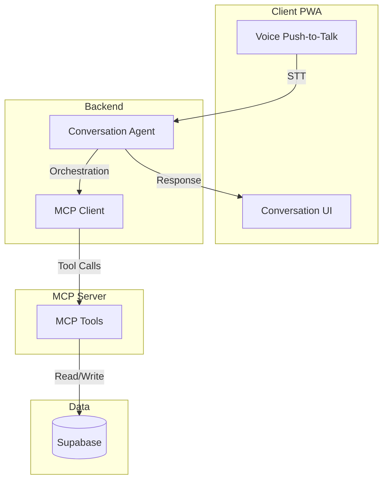

# Architecture

## Purpose

Describes the high-level structure and technology choices of Horain. The system is designed as a **client application controlling an AI agent that uses MCP tools**.

## High-Level Overview

**Principle:** The agent **never** manipulates the database directly. All data operations go through MCP tools.

## Components

| Component | Responsibility | Location / Tech |
|-----------|----------------|-----------------|
| Client | PWA, push-to-talk, conversation UI | Vue 3, PrimeVue, Vite |
| Backend | Hosts agent; receives transcript, orchestrates, calls MCP | Spring AI or equivalent (Render) |
| MCP Client | Connects agent to MCP Server; invokes tools | Part of backend |
| MCP Server | Exposes tools (list_projects, search_project, create_project, log_time, list_recent_logs) | Separate process or co-located |
| Supabase | Storage for projects and time_logs | PostgreSQL |

## Technology Stack

- **Front-end:** Vue 3, PrimeVue, Vite, HTML, CSS
- **Backend:** Java Spring AI (or equivalent) on Render
- **MCP:** MCP Server exposing tools; MCP Client in backend
- **Database:** Supabase (PostgreSQL)
- **Deployment:** GitHub Pages (front), Render (backend), GitHub Actions
- **Tests e2e:** Playwright

## Execution Model

1. **User speaks** → voice captured via push-to-talk
2. **STT** → transcript sent to backend
3. **Agent** receives transcript, infers intent and entities
4. **Agent** calls MCP tools (search_project, create_project, log_time) as needed
5. **MCP tools** read/write Supabase (only path to data)
6. **Agent** returns conversational response to client
7. **Client** displays response in conversation thread

## Key Directories (to create)

| Path | Role |
|------|------|
| `src/` | Front-end Vue source |
| `backend/` or `api/` | Spring AI + MCP client |
| `mcp-server/` or embedded | MCP Server with tools |
| `e2e/` | Playwright e2e tests |
| `docs/MCP_TOOLS.md` | MCP tools specification |
| `docs/DATA_MODEL.md` | Database schema |
| `docs/UX.md` | UI/UX specification |

## Assumptions and Uncertainties

- [ASSUMPTION] MCP Server can be co-located with backend or run separately.
- [ASSUMPTION] Primary target device: Pixel 9a (mobile-first).
- [UNCERTAIN] STT: Web Speech API (client) vs server-side (e.g. Whisper).
