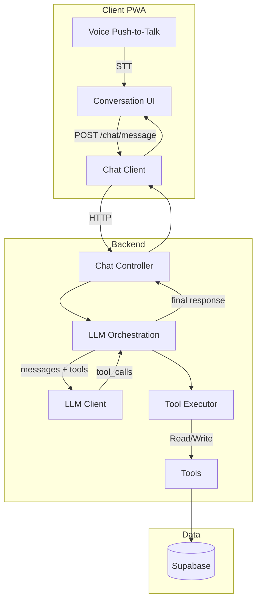

# Architecture

## Purpose

Describes the high-level structure and technology choices of Horain. The system is designed as a **client application controlling an AI agent that uses MCP tools**.

## High-Level Overview

```mermaid
flowchart TB
    subgraph client [Client PWA]
        Voice[Voice Push-to-Talk]
        UI[Conversation UI]
        ChatClient[Chat Client]
    end
    
    subgraph backend [Backend]
        ChatCtrl[Chat Controller]
        LlmSvc[LLM Orchestration]
        LlmClient[LLM Client]
        ToolExec[Tool Executor]
        Tools[Tools]
    end
    
    subgraph data [Data]
        Supabase[(Supabase)]
    end
    
    Voice -->|STT| UI
    UI -->|POST /chat/message| ChatClient
    ChatClient -->|HTTP| ChatCtrl
    ChatCtrl --> LlmSvc
    LlmSvc -->|messages + tools| LlmClient
    LlmClient -->|tool_calls| LlmSvc
    LlmSvc --> ToolExec
    ToolExec -->|Read/Write| Tools
    Tools --> Supabase
    LlmSvc -->|final response| ChatCtrl
    ChatCtrl --> ChatClient
    ChatClient --> UI
```

**Principle:** The LLM **never** manipulates the database directly. All data operations go through tools invoked by the orchestration layer.

## Components

| Component | Responsibility | Location / Tech |
|-----------|----------------|-----------------|
| Client | PWA, push-to-talk, conversation UI | Vue 3, Vite, custom UI (see UX.md) |
| Chat Client | Sends messages to POST /chat/message | frontend/src/services/chatClient.ts |
| Backend | Chat endpoint, LLM orchestration, tool execution | Spring Boot (Render) |
| LLM Client | Spring AI ChatModel (OpenAI-compatible) or fallback RestTemplate client | backend llm/ package |
| Tool Executor | Dispatches tool calls to ProjectService, TimeLogService, AnalyticsService | backend tools/ package |
| Supabase | Storage for projects and time_logs | PostgreSQL |

## MCP: Outils intégrés

Horain n’utilise pas de serveur MCP externe. Les outils sont **intégrés au backend** et exposés via le *tool calling* de Spring AI / OpenAI. La sémantique est alignée sur [MCP_TOOLS.md](MCP_TOOLS.md) : `list_projects`, `search_project`, `create_project`, `create_time_log`, `get_recent_logs`, etc. Le LLM appelle ces outils par nom et arguments ; `ToolExecutorService` exécute les opérations (lecture/écriture via JPA sur PostgreSQL ou H2).

Implémentation : `backend/.../tools/ToolRegistry.java`, `ToolExecutorService.java`.

## Technology Stack

- **Front-end:** Vue 3, Vite, HTML, CSS (custom UI, no PrimeVue)
- **Backend:** Spring Boot 3.5, Spring AI 1.1.2 (OpenAI ChatModel) on Render
- **Tools:** Integrated in backend (MCP_TOOLS semantics), Spring AI tool calling
- **Database:** Supabase (PostgreSQL 17). Schema evolution via Flyway 11 (migrations at startup).
- **Deployment:** GitHub Pages (front), Render (backend), GitHub Actions
- **Tests e2e:** Playwright

## Execution Model

1. **User speaks** → voice captured via push-to-talk
2. **STT** → transcript sent to backend
3. **Agent** receives transcript, infers intent and entities
4. **Agent** calls MCP tools (search_project, create_project, log_time) as needed
5. **MCP tools** read/write Supabase (only path to data)
6. **Agent** returns conversational response to client
7. **Client** displays response in conversation thread

## Key Directories

| Path | Role |
|------|------|
| `frontend/src/` | Vue front-end source |
| `frontend/e2e/` | Playwright e2e tests |
| `backend/` | Spring AI + tools (ToolRegistry, ToolExecutorService) |
| `docs/MCP_TOOLS.md` | MCP tools specification |
| `docs/DATA_MODEL.md` | Database schema |
| `docs/UX.md` | UI/UX specification |

## Assumptions and Uncertainties

- [ASSUMPTION] Primary target device: Pixel 9a (mobile-first).
- [UNCERTAIN] STT: Web Speech API (client) vs server-side (e.g. Whisper).
