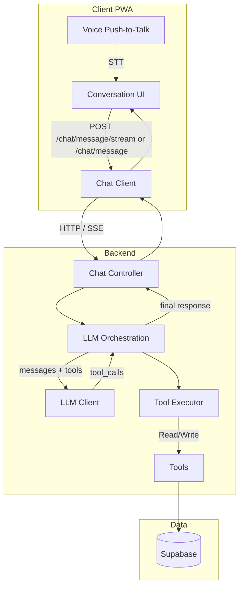

# Architecture

## Purpose

Describes the high-level structure and technology choices of Horain. The system is designed as a **client application controlling an AI agent that uses MCP tools**. The primary constraint for this design is **context management**: agent and tool architecture follows *context engineering* principles (see [AGENT_DESIGN.md](AGENT_DESIGN.md)).

## High-Level Overview

```mermaid
flowchart TB
    subgraph client [Client PWA]
        Voice[Voice Push-to-Talk]
        UI[Conversation UI]
        ChatClient[Chat Client]
    end
    
    subgraph backend [Backend]
        ChatCtrl[Chat Controller]
        LlmSvc[LLM Orchestration]
        LlmClient[LLM Client]
        ToolExec[Tool Executor]
        Tools[Tools]
    end
    
    subgraph data [Data]
        Supabase[(Supabase)]
    end
    
    Voice -->|STT| UI
    UI -->|POST /chat/message/stream or /chat/message| ChatClient
    ChatClient -->|HTTP / SSE| ChatCtrl
    ChatCtrl --> LlmSvc
    LlmSvc -->|messages + tools| LlmClient
    LlmClient -->|tool_calls| LlmSvc
    LlmSvc --> ToolExec
    ToolExec -->|Read/Write| Tools
    Tools --> Supabase
    LlmSvc -->|final response| ChatCtrl
    ChatCtrl --> ChatClient
    ChatClient --> UI
```

**Principle:** The LLM **never** manipulates the database directly. All data operations go through tools invoked by the orchestration layer.

## Components

| Component | Responsibility | Location / Tech |
|-----------|----------------|-----------------|
| Client | PWA, push-to-talk, conversation UI | Vue 3, Vite, custom UI (see UX.md) |
| Chat Client | Sends messages to POST /chat/message/stream (SSE); fallback to POST /chat/message on 404/405 | frontend/src/services/chatClient.ts |
| Backend | Chat endpoint, LLM orchestration, tool execution | Spring Boot, Kotlin (Cloud Run) |
| LLM Client | Spring AI ChatModel (OpenAI-compatible) or fallback WebClient client | backend `llm/` package (Kotlin) |
| Tool Executor | Dispatches tool calls to ProjectService, TimeLogService, AnalyticsService | backend tools/ package |
| Supabase | Storage for projects and time_logs | PostgreSQL |

## MCP: Outils intégrés

Horain n’utilise pas de serveur MCP externe. Les outils sont **intégrés au backend** et exposés via le *tool calling* de Spring AI / OpenAI. La sémantique est alignée sur [MCP_TOOLS.md](MCP_TOOLS.md) : `list_projects`, `search_project`, `create_project`, `create_time_log`, `get_recent_logs`, etc. Le LLM appelle ces outils par nom et arguments ; `ToolExecutorService` exécute les opérations (lecture/écriture via JPA sur PostgreSQL ou H2).

Implémentation : `backend/.../tools/ToolRegistry.kt`, `ToolExecutorService.kt`.

When agent capabilities grow (many tools or more complex workflows), consider a **sub-agent** architecture: a dedicated system prompt, a restricted tool set, and a focused objective. This reduces context pollution and improves reasoning reliability. See [AGENT_DESIGN.md](AGENT_DESIGN.md).

The SSE stream supports **optional reasoning**: events `reasoning_chunk` (text deltas) and optional fields `reasoningText` / `reasoningDurationMs` in the `done` payload. When the selected LLM client exposes reasoning (e.g. OpenAI Responses API with a reasoning model), the backend forwards it; otherwise the stream is unchanged.

**Multi-model orchestration (3 levels):** When `LLM_MODEL_SIMPLE`, `LLM_MODEL_COMPLEX`, and `LLM_MODEL_VERY_COMPLEX` are all set, the backend uses a **ComplexityClassifier** (rule-based, 3 classes) and a **RoutingLlmClient** to select one of three clients per request: **simple** (no reasoning, e.g. Chat Completions), **complex** (reasoning model with medium effort), **very complex** (reasoning model with high effort). The same client is used for the whole tool loop; the selected model name is stored in `agent_turn.model`. If only `LLM_MODEL` is set, behaviour is unchanged (single client, no routing).

## Technology Stack

- **Front-end:** Vue 3, Vite, HTML, CSS (custom UI, no PrimeVue)
- **Backend:** Spring Boot 3.5, Kotlin, Spring AI 1.1.2 (OpenAI ChatModel) on Cloud Run
- **Tools:** Integrated in backend (MCP_TOOLS semantics), Spring AI tool calling
- **Database:** Supabase (PostgreSQL 17). Schema evolution via Flyway 11 (migrations at startup).
- **Deployment:** GitHub Pages (front), Cloud Run (backend via Cloud Build trigger), GitHub Actions
- **Tests e2e:** Playwright

## Execution Model

1. **User speaks** → voice captured via push-to-talk
2. **STT** → transcript sent to backend
3. **Agent** receives transcript, infers intent and entities
4. **Agent** calls MCP tools (search_project, create_project, log_time) as needed
5. **MCP tools** read/write Supabase (only path to data)
6. **Agent** returns conversational response to client
7. **Client** displays response in conversation thread

Each assistant response is **traced** in `agent_turn` (user message, assistant message, tool calls, status, model, system prompt version). The client can submit **feedback** (thumb up/down) via POST /chat/feedback, stored in `agent_feedback`. The **eval pipeline** (see [EVALS.md](EVALS.md)) uses these tables as a source of incidents and user signals: extraction script → triage → promotion of selected cases into Promptfoo tests.

### Optional external observability (LangSmith, OTLP)

- **Interface:** `AgentTraceSink` (`onTurnCompleted`, `onFeedback`) in `backend/.../observability/`. Default: no-op; no outbound traffic.
- **LangSmith:** When `HORAIN_OBSERVABILITY_PROVIDER=langsmith` and `LANGCHAIN_API_KEY` is set, the backend POSTs runs to the LangSmith API (`/runs`) and feedback to `/feedback`, asynchronously. The tracing **project** is configured by name only (`LANGSMITH_PROJECT`). On first export, the backend resolves that name to a tracer session UUID via `GET /api/v1/sessions?name=...`, caches it, and sends it in the `Langsmith-Project` header; `session_name` on the run still uses the configured project name. **Threads:** The chat API returns a `conversationId` per turn; the client must send it back on follow-up messages (`conversationId` in the JSON body). That UUID is stored on `agent_turn` and exported in run metadata as `conversation_id` and `thread_id` so LangSmith groups turns into one thread. **Reasoning:** When the LLM exposes `reasoningSummary` per round (Responses API / streaming), phases are collected in `TurnCompletedEvent.reasoningPhases`; after the root run `horain.agent.turn` is created, optional child runs `horain.agent.reasoning` are POSTed with `parent_run_id` set to that root run. **Tool calls:** Each tool invocation is exported as a child run with `run_type` `tool`, the tool name as run name, `inputs.arguments` and `outputs.result` (truncated if large), after reasoning children on the timeline. Root and children share `trace_id` (= root run id) so LangSmith nests them in one trace; use **Trace View** for the full span tree (Turn View may summarize steps). Do not confuse with `session_id` on runs (tracer session): sending a random `session_id` causes 404. The LangSmith run id is stored in `agent_turn.external_trace_id`. Pending feedback is buffered until the run id is known (race with async export).
- **Native trace:** `horain.observability.keep-native-trace` defaults to true; turns are always written to the database regardless of external export (see [ADR/ADR-optional-external-agent-observability.md](ADR/ADR-optional-external-agent-observability.md)).
- **Metrics:** Micrometer counter `horain.observability.export` with tags `kind` (turn | feedback) and `result` (success | failure).
- **OpenTelemetry:** `micrometer-tracing-bridge-otel` + OTLP exporter. Set `OTEL_TRACING_EXPORT_ENABLED=true`, `OTEL_EXPORTER_OTLP_ENDPOINT`, and optionally `OTEL_TRACE_SAMPLING_RATIO` to export spans; `LlmChatService` records a span `horain.agent.turn` with tags `turn.id`, `conversation.id`, `horain.model`, `horain.status`, `latency.ms`. Disable export in environments where OTLP is not used (default: export off).

## Key Directories

| Path | Role |
|------|------|
| `frontend/src/` | Vue front-end source |
| `frontend/e2e/` | Playwright e2e tests |
| `backend/` | Spring AI + tools (ToolRegistry, ToolExecutorService) |
| `docs/MCP_TOOLS.md` | MCP tools specification |
| `docs/DATA_MODEL.md` | Database schema |
| `docs/UX.md` | UI/UX specification |

## Assumptions and Uncertainties

- [ASSUMPTION] Primary target device: Pixel 9a (mobile-first).
- [UNCERTAIN] STT: Web Speech API (client) vs server-side (e.g. Whisper).
